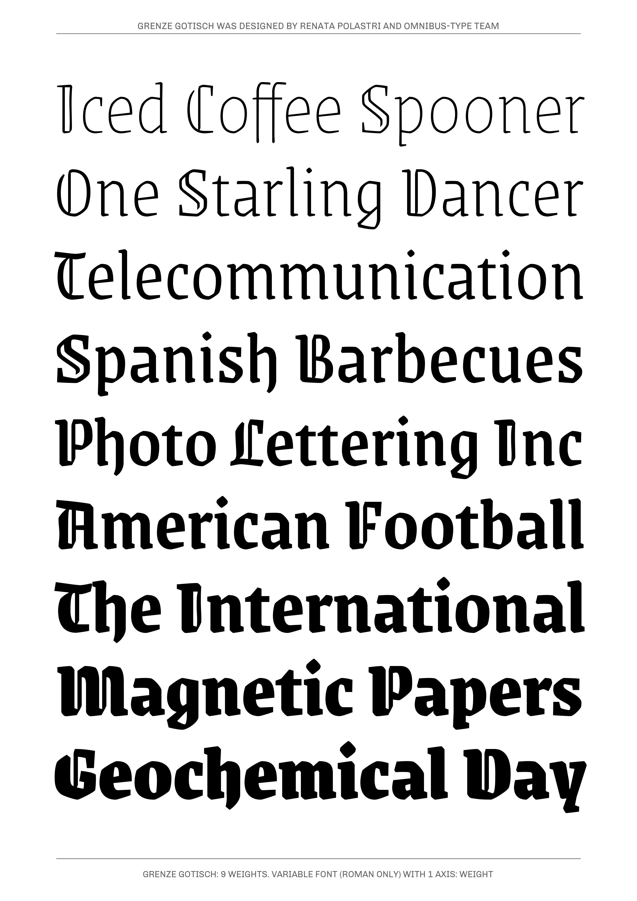
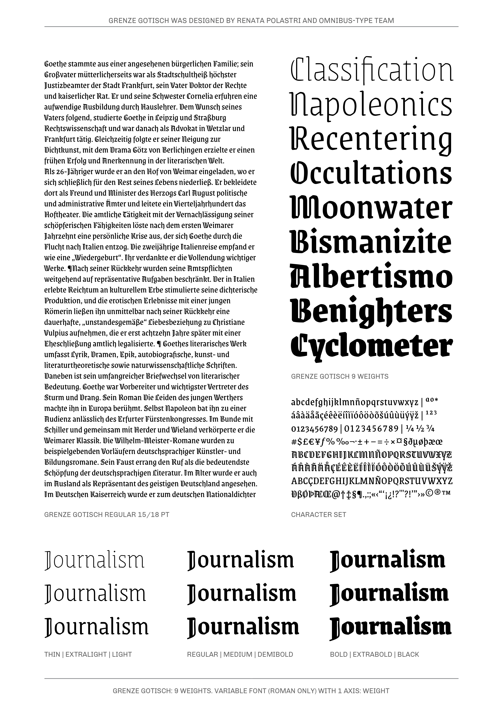

# Grenze-Gotisch  family

**Omnibus-Type**  
*SIL Open Font License, 1.1*

Grenze Gotisch: a peculiar version of Grenze, now presenting Blackletter uppercase letters and little dramatic details in certain lowercase letters, which intensify its expressive burden.

#### Grenze Gotisch Family contains:

* Thin
* ExtraLight
* Light
* Regular
* Medium
* Semibold
* Bold
* ExtraBold
* Black

To contribute to the project contact [Omnibus Type](http://omnibus-type.com/).

### Designers

* Renata Polastri

## Building

Fonts are built automatically by GitHub Actions - take a look in the "Actions" tab for the latest build.

If you particularly want to build fonts manually on your own computer, you will need to install the [`yq` utility](https://github.com/mikefarah/yq). On OS X with Homebrew, type `brew install yq`; on Linux, try `snap install yq`; if all else fails, try the instructions on the linked page.

Then:

* `make build` will produce font files.
* `make test` will run [FontBakery](https://github.com/googlefonts/fontbakery)'s quality assurance tests.
* `make proof` will generate HTML proof files.

## License

Copyright (c) 2020, Omnibus-Type (www.omnibus-type.com | omnibus.type@gmail.com)

This Font Software is licensed under the SIL Open Font License, Version 1.1.
This license is copied below, and is also available with a FAQ at
http://scripts.sil.org/OFL

## Repository Layout

This font repository structure is inspired by [Unified Font Repository v0.3](https://github.com/unified-font-repository/Unified-Font-Repository), modified for the Google Fonts workflow.

======
## FONTLOG for the Grenze Gotisch fonts

This file provides detailed information on the Grenze Gotisch font software.  
This information should be distributed along with the Grenze Gotisch fonts and any derivative works.

### Grenze Gotisch is a typeface family that supports Unicode language range: 

* Basic Latin 					U+0020-U+007E
* Latin-1 Supplement 			U+00A0-U+00FF
* Latin Extended-A 				U+0100-U+017F
* Latin Extended Additional*	U+1E00-U+1EFF *(111/256)

**Character map to support MS Codepages:**
* 1252 Latin-1
* 1250 Latin-2 (Easter Europe)
* 1254 Turkish
* 1257 Windows Baltic
* 1258 Vietnamese
* Mac Roman

*To contribute to the project contact Omnibus-Type at omnibus.type@gmail.com*

**04 Jan 2020 (v.1.000) Omnibus-Type**  
- Initial release

### Acknowledgements

If you make modifications be sure to add your name (N), email (E), web-address
(if you have one) (W) and description (D). This list is in alphabetical order.

**N:** **Oscar Guerrero Cañizares**  
**E:** omnibus.type@gmail.com  
**W:** http://www.omnibus-type.com  
**D:** Typeface development

**N:** **Pablo Cosgaya**  
**E:** omnibus.type@gmail.com  
**W:** http://www.omnibus-type.com  
**D:** Typeface development

**N:** **Renata Polastri**  
**E:** omnibus.type@gmail.com  
**W:** http://www.omnibus-type.com  
**D:** Designer
